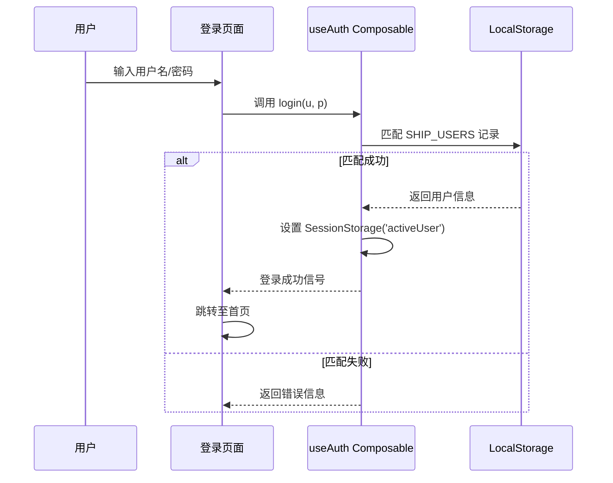
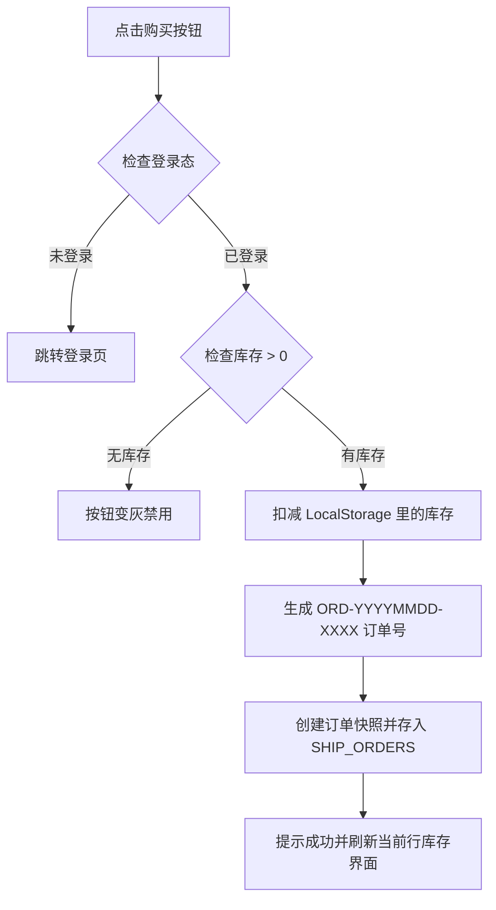

# Implementation Plan: 用户登录、舱位购买及订单查询

**Branch**: `003-user-auth-ordering` | **Date**: 2026-01-13 | **Spec**: [spec.md](./spec.md)
**Input**: Feature specification from `/specs/003-user-auth-ordering/spec.md`

## Summary
本项目将在现有的船期查询功能之上，通过前端模拟后端的方式（Storage Service + LocalStorage），实现完整的用户认证逻辑、带有库存控制的舱位购买流程以及个人订单的历史查询。

## Technical Context

**Language/Version**: TypeScript 5.2, Vue 3.4 (Vite)  
**Primary Dependencies**: vue-router (路由拦截), Pinia (拟采用状态管理), Tailwind CSS (UI)  
**Storage**: LocalStorage (持久化存储用户、库存和订单), SessionStorage (临时存储登录会话)  
**Testing**: vitest, @vue/test-utils  
**Target Platform**: 现代 Web 浏览器  
**Project Type**: Single Page Application (SPA)  
**Performance Goals**: 登录/下单响应 < 500ms (本地 IO 操作)  
**Constraints**: 浏览器安全限制（由于无法直接写入源码中的 JSON 文件，采用 LocalStorage 镜像方案）。

## Constitution Check

- [x] **中文优先**: 计划书及后续文档使用中文编写。
- [x] **Mermaid 图表**: 系统流程图使用 Mermaid 语法。
- [x] **术语一致性**: 定义并记录了 `Inventory Snapshot`, `Session Session` 等术语。
- [x] **流程合规**: 覆盖了从 Spec 澄清到研究、设计、计划的推导演变。

## Architecture & Flows

### 登录与授权流程 (Mermaid)


### 下单流程 (Mermaid)


## Project Structure

### Documentation (this feature)

```text
specs/003-user-auth-ordering/
├── plan.md              # 方案计划书 (本文件)
├── research.md          # 存储持久化与前端模拟研究
├── data-model.md        # 实体定义 (User, Order, Schedule)
├── quickstart.md        # 快速上手指南
├── contracts/           
│   └── interfaces.md    # 模拟后端服务的接口定义
└── tasks.md             # 后续待生成的任务列表
```

### Source Code Mapping

```text
src/
├── assets/
│   ├── users.json       # [New] 初始化 5 个默认用户
│   ├── schedules.json   # [Modified] 增加 inventory 字段
│   └── orders.json      # [Deprecated] 仅作结构参考，生产用 LocalStorage
├── models/
│   ├── user.ts          # [New] 用户模型定义
│   ├── order.ts         # [New] 订单模型定义
│   └── schedule.ts      # [Modified] 增加库存属性
├── services/            # [New] 模拟后端逻辑层
│   ├── storageService.ts# 本地持久化封装
│   ├── authService.ts   # 认证逻辑
│   └── orderService.ts  # 下单逻辑
├── composables/
│   ├── useAuth.ts       # 登录态全局 Hooks
│   ├── useOrders.ts     # 订单操作 Hooks
│   └── useSchedules.ts  # [Modified] 适配 LocalStorage 版数据源
├── views/
│   ├── LoginView.vue    # [New] 登录页
│   └── OrdersView.vue   # [New] 订单查询页
└── router.ts            # [Modified] 增加全局路由守卫 (Auth Guard)
```

## Risks & Mitigations
- **数据一致性**: 页面刷新后内存中 Vue 状态可能与 LocalStorage 一致。**对策**: 在 `onMounted` 或 Composable 初始化时强制从 LocalStorage 重拉最新数据。
- **并发冲突**: 多个标签页开启时可能导致库存扣减冲突。**对策**: 由于是 Demo，采用简单覆盖模式；若需严格，可增加 `window.addEventListener('storage')` 实时同步。
