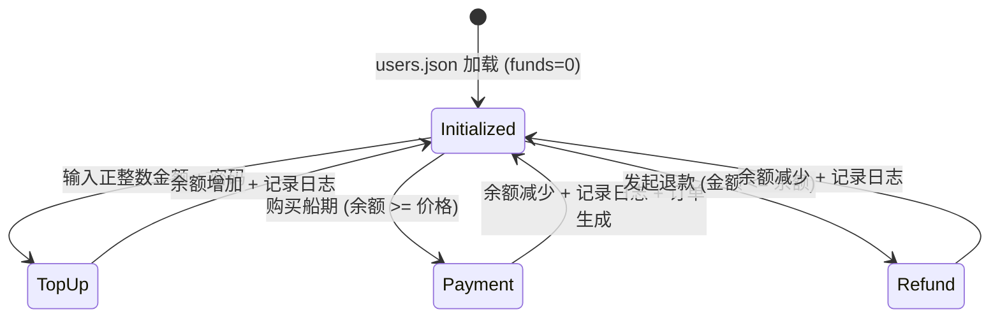

# Data Model: 005-user-funds-stats

## 实体扩展与新增

### 1. User (用户) - 扩展字段
在原有的用户模型中增加资金账户支持。

| 字段 | 类型 | 说明 | 校验/约束 |
| :--- | :--- | :--- | :--- |
| `funds` | Number | 账户余额 (CNY) | 默认为 0，不可为负 |
| `transactionLogs` | Array | 交易日志记录 | 见下文 TransactionLog 结构 |

### 2. TransactionLog (交易日志)
用于记录用户的所有资金变动。

| 字段 | 类型 | 说明 | 约束 |
| :--- | :--- | :--- | :--- |
| `id` | String | 唯一标识符 | UUID/时间戳 |
| `timestamp` | String (ISO) | 交易时间 | 必填 |
| `type` | String | 类型 | `TOP_UP` (充值), `REFUND` (退款), `PAYMENT` (支付) |
| `amount` | Number | 变动金额 | 充值/支付需为正值 |
| `balanceAfter` | Number | 变动后余额 | 必填 |
| `orderId` | String | 关联订单ID | 仅 `PAYMENT` 类型可选 |

### 3. Schedule (船期) - 字段增强
| 字段 | 类型 | 说明 | 逻辑 |
| :--- | :--- | :--- | :--- |
| `price` | Number | 购买价格 | 初始化时计算：`运输天数 * 5` |

---

## 统计数据聚合逻辑

### 1. 热门船期 (Hot Schedules)
*   **周期**: 滑动 7 天 (过去 168 小时)。
*   **逻辑**: 统计过去 7 天内被购买次数最多的前 N 个船期。
*   **计算公式**: `Count(Orders where OrderDate >= Today - 7 Days) Group By ScheduleId`

### 2. 个人资金/订单统计
*   **权限**: 用户仅能看到属于自己的订单和金额数据。
*   **逻辑**: 基于 `userId` 过滤订单和日志数据，进行求和与趋势分析。

---

## 状态转换与业务规则 Mermaid

